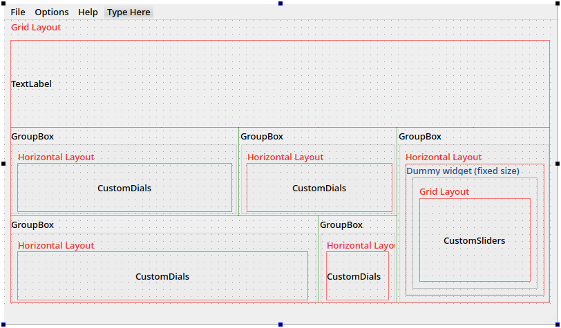

# test interface

Je mets ici une proposition d'interface. Pour les couleurs, je n'avais pas beaucoup d'inspiration, donc j'ai allègrement utilisé celles de mon interface de VisualCode. Je me suis un peu inspiré aussi de l'apparence des Prophet.
Cette interface permet :
- de contrôler des paramètres du synthé via les classes State et StateParameter
- les paramètres de base sont contrôlés graphiquement par des potentiomètres (classe CustomDial), les modulateurs par une matrice de modulation constituée de plusieurs CustomSlider.
- de sauvegarder la configuration dans un fichier choisi par l'utilisateur, et de la charger à partir d'un fichier
- de sauvegarder automatiquement la configuration à la fermeture
- on peut contrôler les potentiomètres et les éléments de la matrice de modulation en midi. Pour définir quel CC utiliser, on peut utiliser le clic du milieu de la souris

Tout n'est pas encore bien fini, il y a une to-do list en début de ```main.cpp```

# Classe Window et disposition
```Window``` hérite de ```QMainWindow``` de Qt, ce qui permet d'avoir une barre de menu, une barre d'état qui sert pour l'instant uniquement à afficher la valeur du paramètre qui est en train d'être modifié, et un espace central pour y placer des widgets. L'espace central utilise une disposition en grille (```QGridLayout```), dans laquelle se placent des ```QGroupBox``` (qui permettent facilement d'avoir des sections séparées). Chaque groupBox dispose ses widgets horizontalement avec ```QHBoxLayout```. Pour la matrice de modulation, il y a en plus un widget qui permet de contrôler la taille de la section, et dans lequel la disposition des ```CustomSlider``` (et des noms des inputs et des modificateurs) est gérée par ```QGridLayout```.

J'ai essayé de représenter ça sur l'image suivante, tu me diras si c'est clair.


# Contrôles

Les classes qui permettent de contrôler les paramètres sont héritées de classe de Qt. Chacune redéfinit un ```mousePressEvent``` (qui est utilisée par Qt pour gérer les évènements liés à la souris) pour permettre à l'utilisateur de définir un CC midi lié à cet contrôle. De plus, ces classes ont toute un ```StateParameter``` qui permet de modifier les valeurs utilisées par le synthé (voir plus bas).

## Classe CustomDial :
Cette classe hérite de la classe ```QDial``` de Qt. La fonction ```paintEvent``` est redéfinie pour pouvoir modifier l'apparence, ce qui permet principalement d'afficher le nom du paramètre associé au potentiomètre, de modifier les couleurs et de modifier la forme de l'indicateur.

## Classe CustomSlider :
Cette classe hérite de la classe ```QSlider``` de Qt, et il y a cette fois-ci un peu plus de changements. ```paintEvent``` est redéfinie, ainsi que les fonctions qui permettent de contrôler le slider avec la souris.

# fileio :
La configuration est sauvegardée à chaque fermeture dans le fichier "Config/Autosave.cfg", et est chargée à chaque ouverture du programme depuis ce fichier. Le dernier emplacement de sauvegarde est enregistré dans le fichier "Config/Cong.cfg". C'est à ce dernier emplacement que la configuration est sauvegardée si on sélectionne "File>Save configuration" (ou Ctrl+S). Ce comportement ne fonctionne que si le programme est lancé depuis le sous-dossier build, je n'ai pas trouvé comment faire autrement simplement.

# state.h :
J'ai essayé de faire une classe facile à utiliser, mais je ne sais pas si je suis parti dans la bonne direction, tu me diras ce que tu en penses.

Le fichier state.h déclare trois classes :
- StateParameter : c'est essentiellement un flottant qui est repéré par son nom unique. C'est à dire que si un StateParameter de nom "osc.freq" est déclaré à deux endroits différents dans le programme, les deux paramètres déclarés vont avoir toujours la même valeur. Pour déclarer, on utilise la syntaxe : ```StateParameter param("osc.freq");```. On peut lui associer un dial ou un slider. L'idée est qu'il suffit de remplacer un ```float``` dans une classe qu'on veut contrôler (par exemple ```Osc```) par un ```StateParameter``` qui se comportera principalement comme un ```float```, mais dont la valeur sera pilotable (par exemple par un CutomDial). Si c'est pertinent, on peut aussi associer un callback à ```StateParameter``` (voir exemple plus bas). La fonction qu'on utilise comme callback doit avoir un prototype de la forme ```void(float)```, et l'argument (float) qu'elle reçoit est la valeur du paramètre. Cette fonction doit être un ```class member``` non statique.
- StateData : regroupe les pointeurs vers tous les StateParameter de même nom.
- State : classe principale, déclarée par StateParameter. Elle regroupe tous les StateParameters dans un vecteur de StateData. Elle permet de synchroniser les valeurs des StateParameters, d'assigner un CC midi à un paramètre, et appelle les fonctions de lecture/écriture de fichiers de ```fileio```.


```c++
//To declare a new parameter, used eg in an Osc:
    
    //Creating parameter identified by its paramName
    //If a parameter with the same name already exists, the value of param is set to the existing value
    //If not, it gets a 0 value.
    //The parameter is then added to State
        StateParameter *param =  new StateParameter(paramName);

    //Change the value of param, and change value of all dials and parameters with the same name
        *param = 15;
    //You can also use
        param->setValue(15)
        //it changes value of all dials and parameters with the same name, 
        //but if the parameter name doesn't already exist, it is not added to State
        //and if a ptr to param if not in State, it is not added

    //If two StateParameter share the same name, they also share the same value :
        StateParameter s("test");
        StateParameter t("test");
        s = 15;
        cout << "Value of s is : "<< s << endl; // Value of s is : 15
        cout << "Value of t is : "<< t << endl; // Value of t is : 15

    //The value of param can be accessed like this:
        StateParameter u("test2");
        float value;
        value = u;
    
    //if you try to copy a param, like this:
        StateParameter v("test3");
        StateParameter w("otherTest");
        v = 15;
        w = v;
        //only the value of v is copied to w, the name of w stays "otherTest"

//To access State class, which holds all parameters:
    State* state = StateParameter::state;

//If you want to create a parameter with no callback to it (eg when reading conf from file), you can use:
    StateParameter* p = new StateParameter; //p is not added to State
    p->name = "paramName"; 
    p->value = 15;//the value of p is changed, but the value of parameters with the same name is unchanged 
    state->addParameter(p, false);//updates the value of every parameter with the same name
    //argument false : doesn't add parameter to the vector that State holds
```
## Utilisation d'un callback :
```c++
class Osc{
	public:
		float freq = 0;
		StateParameter s("osc.freq");
		void setFreq(float i){
			freq = i;
		};
		Osc(){
			s.setCallback(&Osc::setFreq, this);
		};
};
```
